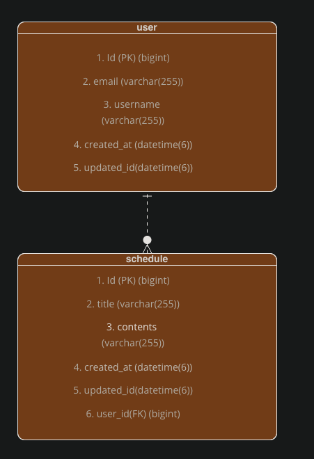

## 📌 ERD

## 📌 Schedule API 명세서

| 기능       | 메서드    | URL             | Request                                                  | Request 샘플                                              | Response 샘플                                                                                                                                                    | 상태코드 |
|----------|--------|-----------------|----------------------------------------------------------|---------------------------------------------------|----------------------------------------------------------------------------------------------------------------------------------------------------------------|------|
| 일정 생성    | POST   | /schedules      | 할일 : String(필수)  내용: String(필수)  유저아이디: Long(필수) | { "title": "제목", "contents": "내용" }, "userId" : 1 | {"id": 1,"title": "test1","contents": "test1","createdAt": "작성일","user": {"id": 1,"email": "test1@naver.com","username": "test"}}                              | 201  |
| 일정 전체 조회 | GET    | /schedules      |                  |         | [{"id": 1,"title": "test1","contents": "test1","createdAt": "작성일","updatedAt": "수정일","user": {"id": 1,"email": "test1@naver.com","username": "test"}]          | 200  |
| 일정 단건 조회 | GET    | /schedules/{id} |                                                          |                                                   | {"id": 1,"title": "test1","contents": "test1","createdAt": "작성일","updatedAt": "수정일","user": {"id": 1,"email": "test1@naver.com","username": "test"} | 200  |
| 일정 수정    | PUT    | /schedules/{id}  |할일 : String(필수)  내용: String(필수)  유저아이디: Long(필수)| `{ "title": "제목", "contents": "내용" }, "userId" : 1 |{"id": 1,"title": "test1","contents": "test1","createdAt": "작성일","updatedAt": "수정일","user": {"id": 1,"email": "test1@naver.com","username": "test"}| 200  |
| 일정 삭제    | DELETE |         /schedules/{id}        |  유저아이디: Long(필수)      |              {"userId" : 1}                                     |                                                                                                                                                                | 200  |

## 📌 User API 명세서

| 기능         | 메서드    | URL        | Request                                                       | Request 샘플                                                                | Response 샘플                                                                                        | 상태코드     |
|------------|--------|------------|---------------------------------------------------------------|---------------------------------------------------------------------------|----------------------------------------------------------------------------------------------------|----------|
| 회원 가입      | POST   | /users/signup | 이메일 : String(필수)  유저 이름: String(필수)  비밀번호: String(필수) | {"email" : "test1@naver.com", "username" : "test", "password" : "1234" }, | {"id": 1,"email": "test1@naver.com", "username": "test", "createdAt": "생성일", "updatedAt" : "수정일" } | 201      |
| 로그인        | POST   | /users/login | 이메일 : String(필수)  비밀번호: String(필수)                        | {"email": "test1@naver.com", "password": "1234"}                          |                                                                                                    | 200, 401 |
| 유저 전체 조회   | GET    | /users |                                                               |                                                                           | [{"id": 1,"email": "test1@naver.com","username": "test","createdAt": "생성일","updatedAt": "수정일"}]    | 200      |
| 유저 단건 조회   | GET    | /users/{id} |                                                               |                                                                           | {"id": 1,"email": "test1@naver.com","username": "test","createdAt": "생성일","updatedAt": "수정일"}      | 200      |
| 유저 비밀번호 수정 | PUT    | /users/{id} | 이전 비밀번호 : String(필수)  수정할 비밀번호 :   String(필수)| {"oldPassword" : "1234"  , "newPassword" : "te23123213123st2"  | {"id": 1,"email": "test1@naver.com","username": "test","createdAt": "생성일","updatedAt": "수정일"}      | 200      |
| 유저 삭제      | DELETE | /users/{id} |                                            |                                                         |                                                                                                    | 200      |