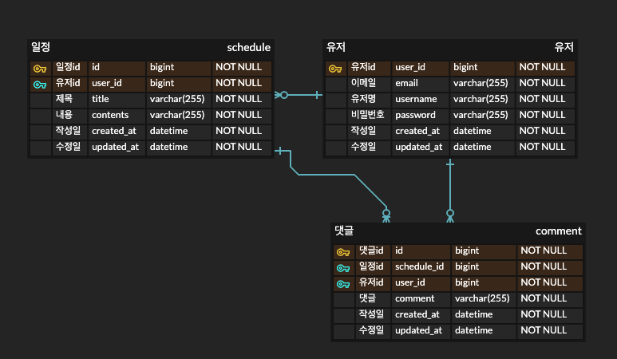

## 일정 관리 앱 - Develop

## 📚 프로젝트 소개
Spring Boot를 기반으로 개발한 일정 관리 시스템입니다.
사용자는 회원가입 및 로그인 후, 개인 일정을 등록/조회/수정/삭제(CRUD)할 수 있습니다.
로그인 상태는 세션(Session)을 통해 유지됩니다.

## ⏰ 프로젝트 기간
- 2025.05.14 ~ 2025.05.26

## 💻 개발 환경
- JDK : Java - 17.0.1
- Framework : Spring Boot - 3.4.5
- IDE : IntelliJ IDEA
- Build : Gradle
- Database : MySQL
- ORM : JPA

## 📌 ERD




## 📌 Schedule API 명세서

| 기능       | 메서드    | URL             | Request                                                  | Request 샘플                                              | Response 샘플                                                                                                                                                    | 상태코드 |
|----------|--------|-----------------|----------------------------------------------------------|---------------------------------------------------|----------------------------------------------------------------------------------------------------------------------------------------------------------------|------|
| 일정 생성    | POST   | /schedules      | 할일 : String(필수)<br/> 내용: String(필수)<br/> 유저아이디: Long(필수) | { "title": "제목", "contents": "내용" }, "userId" : 1 | {"id": 1,"title": "test1","contents": "test1","createdAt": "작성일","user": {"id": 1,"email": "test1@naver.com","username": "test"}}                              | 201  |
| 일정 전체 조회 | GET    | /schedules      |                  |         | [{"id": 1,"title": "test1","contents": "test1","createdAt": "작성일","updatedAt": "수정일","user": {"id": 1,"email": "test1@naver.com","username": "test"}]          | 200  |
| 일정 단건 조회 | GET    | /schedules/{id} |                                                          |                                                   | {"id": 1,"title": "test1","contents": "test1","createdAt": "작성일","updatedAt": "수정일","user": {"id": 1,"email": "test1@naver.com","username": "test"} | 200  |
| 일정 수정    | PUT    | /schedules/{id}  |할일 : String(필수)<br/> 내용: String(필수)<br/> 유저아이디: Long(필수)| `{ "title": "제목", "contents": "내용" }, "userId" : 1 |{"id": 1,"title": "test1","contents": "test1","createdAt": "작성일","updatedAt": "수정일","user": {"id": 1,"email": "test1@naver.com","username": "test"}| 200  |
| 일정 삭제    | DELETE |         /schedules/{id}        |  유저아이디: Long(필수)      |              {"userId" : 1}                                     |                                                                                                                                                                | 200  |


## 📌 User API 명세서

| 기능         | 메서드    | URL        | Request                                                       | Request 샘플                                                                | Response 샘플                                                                                        | 상태코드     |
|------------|--------|------------|---------------------------------------------------------------|---------------------------------------------------------------------------|----------------------------------------------------------------------------------------------------|----------|
| 회원 가입      | POST   | /users/signup | 이메일 : String(필수)<br/> 유저 이름: String(필수)<br/> 비밀번호: String(필수) | {"email" : "test1@naver.com", "username" : "test", "password" : "1234" }, | {"id": 1,"email": "test1@naver.com", "username": "test", "createdAt": "생성일", "updatedAt" : "수정일" } | 201      |
| 로그인        | POST   | /users/login | 이메일 : String(필수)<br/> 비밀번호: String(필수)                        | {"email": "test1@naver.com", "password": "1234"}                          |                                                                                                    | 200, 401 |
| 유저 전체 조회   | GET    | /users |                                                               |                                                                           | [{"id": 1,"email": "test1@naver.com","username": "test","createdAt": "생성일","updatedAt": "수정일"}]    | 200      |
| 유저 단건 조회   | GET    | /users/{id} |                                                               |                                                                           | {"id": 1,"email": "test1@naver.com","username": "test","createdAt": "생성일","updatedAt": "수정일"}      | 200      |
| 유저 비밀번호 수정 | PUT    | /users/{id} | 이전 비밀번호 : String(필수)<br/> 수정할 비밀번호 :   String(필수)| {"oldPassword" : "1234"  , "newPassword" : "te23123213123st2"  | {"id": 1,"email": "test1@naver.com","username": "test","createdAt": "생성일","updatedAt": "수정일"}      | 200      |
| 유저 삭제      | DELETE | /users/{id} |                                            |                                                         |                                                                                                    | 200      |


### 1. 일정등록
<details>
<summary> 1-1. Request </summary>

- Method:POST
- URL : /schedules

```json
curl --location 'http://localhost:8080/schedules' \
--data '{
    "title" : "test1",
    "contents" : "test1",
    "userId" : 1
}'
```
</details>

<details>
<summary> 1-2. Response (201 Created)</summary>

```json
{
  "id": 1,
  "title": "test1",
  "contents": "test1",
  "createdAt": "2025-05-20T16:11:44.503236",
  "user": {
    "id": 1,
    "email": "test1@naver.com",
    "username": "test"
  }
}
```
</details>

### 2. 일정 전체 조회
<details>
<summary> 2-1. Request </summary>

- Method : GET
- URL : /schedules
```json
curl --location 'http://localhost:8080/schedules'
```
</details>

<details>
<summary> 2-2. Response(200 OK) </summary>

```json
[
  {
    "id": 1,
    "title": "test1",
    "contents": "test1",
    "createdAt": "2025-05-20T16:11:44.503236",
    "updatedAt": "2025-05-20T16:11:44.503236",
    "user": {
      "id": 1,
      "email": "test1@naver.com",
      "username": "test"
    }
  },
  {
    "id": 2,
    "title": "test12",
    "contents": "test12",
    "createdAt": "2025-05-20T16:13:26.179068",
    "updatedAt": "2025-05-20T16:13:26.179068",
    "user": {
      "id": 1,
      "email": "test1@naver.com",
      "username": "test"
    }
  }
]
```
</details>

### 3. 일정 단건 조회

<details>
<summary> 3-1. Request </summary>

- Method : GET
- URL : /schedules/id
```json
curl --location 'http://localhost:8080/schedules/1'
```
</details>

<details>
<summary> 3-2. Response(200 OK) </summary>

```json
{
    "id": 1,
    "title": "test1",
    "contents": "test1",
    "createdAt": "2025-05-20T16:11:44.503236",
    "updatedAt": "2025-05-20T16:11:44.503236",
    "user": {
        "id": 1,
        "email": "test1@naver.com",
        "username": "test"
    }
}
```
</details>

### 4. 일정 수정

<details>
<summary> 4-1. Request </summary>

- Method : PUT
- URL : /schedules/id
```json
curl --location --request PUT 'http://localhost:8080/schedules/1' \
--data '{
"title" : "테스트 입니다",
"contents" : "테스트 입니다",
"userId" : 1

}'
```
</details>

<details>
<summary> 4-2. Response(200 OK) </summary>

```json
{
  "id": 1,
  "title": "테스트 입니다",
  "contents": "테스트 입니다",
  "createdAt": "2025-05-20T16:11:44.503236",
  "updatedAt": "2025-05-20T16:14:34.350519",
  "user": {
    "id": 1,
    "email": "test1@naver.com",
    "username": "test"
  }
}
```
</details>

### 5. 일정 삭제

<details>
<summary> 5-1. Request </summary>

- Method : DELETE
- URL : /schedules/id
```json
{
  "userId" : 1
}
```
</details>

### 1. 회원가입

<details>
<summary> 1-1. Request </summary>

- Method : POST
- URL : /users/signup

```json
curl --location 'http://localhost:8080/users/signup' \
--data-raw '{
"email" : "test1@naver.com",
"username" : "test",
"password" : "1234"
}'
```
</details>

<details>
<summary> 1-2. Response(201 CREATED) </summary>

```json
{
  "id": 1,
  "email": "test1@naver.com",
  "username": "test",
  "createdAt": "2025-05-20T16:03:36.325929",
  "updatedAt": "2025-05-20T16:03:36.325929"
}
```
</details>

### 2. 로그인
<details>
<summary> 2-1. Request </summary>

- Method : POST
- URL : /users/login

```json
curl --location 'http://localhost:8080/users/login' \
--data-raw '{
"email": "test1@naver.com",
"password": "1234"
}'
```
</details>


<details>
<summary> 2-1. Response(200 OK) </summary>

```json
로그인 성공
```
</details>

### 3. 유저 전체 조회

<details>
<summary> 3-1. Request </summary>

- Method : GET
- URL : /users

```json
curl --location 'http://localhost:8080/users'
```
</details>

<details>
<summary> 3-2. Response(200 OK) </summary>

```json
[
  {
    "id": 1,
    "email": "test1@naver.com",
    "username": "test",
    "createdAt": "2025-05-20T16:03:36.325929",
    "updatedAt": "2025-05-20T16:03:36.325929"
  }
]
```
</details>

### 4. 유저 단건 조회

<details>
<summary> 4-1. Request </summary>

- Method : GET
- URL : /users/id

```json
curl --location 'http://localhost:8080/users/1'
```
</details>

<details>
<summary> 4-2. Response(200 OK) </summary>

```json
{
  "id": 1,
  "email": "test1@naver.com",
  "username": "test",
  "createdAt": "2025-05-20T16:03:36.325929",
  "updatedAt": "2025-05-20T16:03:36.325929"
}
```
</details>

### 5. 유저 비밀번호 수정

<details>
<summary> 5-1. Request </summary>

- Method : PUT
- URL : /users/id

```json
curl --location --request PUT 'http://localhost:8080/users/1' \
--data '{
"oldPassword" : "1234",
"newPassword" : "te23123213123st2"
}'
```
</details>

<details>
<summary> 5-2. Response(200 OK) </summary>

```json
{
  "id": 1,
  "email": "test1@naver.com",
  "username": "test",
  "createdAt": "2025-05-20T16:03:36.325929",
  "updatedAt": "2025-05-20T16:03:36.325929"
}
```
</details>

### 6. 유저 삭제

<details>
<summary> 6-1. Request </summary>

- Method : DELETE
- URL : /users/id

```json
curl --location --request DELETE 'http://localhost:8080/users/1'
```
</details>

